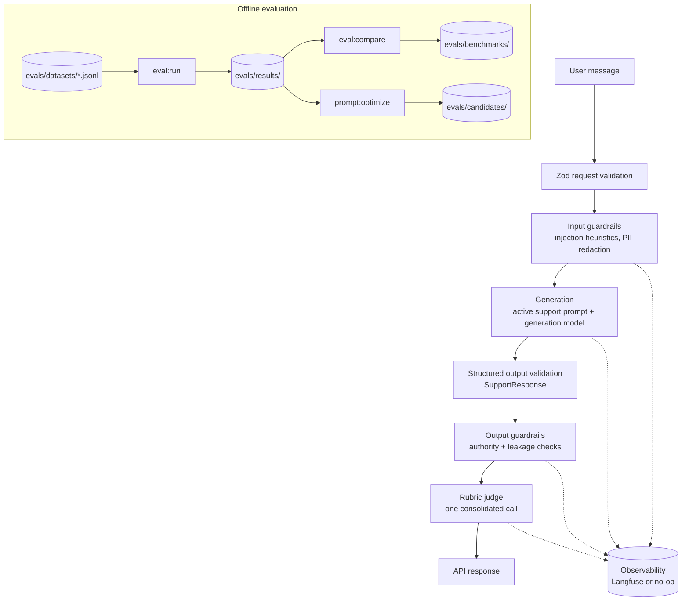

# EvalLab

## What is EvalLab?

EvalLab is a support assistant for a fictional SaaS product, **AcmeCloud**,
built so that its quality, safety and behaviour can be inspected rather than
asserted. Every response passes through guardrails, structured-output
validation and rubric-based evaluation, and the same machinery runs offline
over a versioned eval dataset so prompt changes can be measured instead of
guessed at.

The assistant performs no real support actions. It has no access to accounts,
billing, payments or identity systems, and it cannot issue a refund or cancel
a subscription.

## Live demo

Not currently deployed. Deployment is gated on `ALLOW_DEPLOY=true` plus Vercel
credentials; see [Deployment](#deployment). The application runs locally with
no credentials at all — see [Replay Mode](#replay-mode).

## What it demonstrates

- A production-shaped LLM request pipeline with explicit stages
- Structured model output validated with Zod, never trusted on faith
- Deterministic guardrails separated from LLM-as-judge evaluation
- A versioned prompt registry with an explicitly selected production prompt
- An eval dataset, experiment runner, prompt comparison and candidate search
- Paid-execution controls so a coding agent cannot burn API credit by accident
- Replay Mode, so the site stays useful with no API key

## Architecture



Layout:

| Path | Purpose |
| --- | --- |
| `app/` | Routes: demo page, engineering view, `/api/respond`, `/api/health` |
| `src/ai/` | Client, generation, guardrails, evaluators, prompts, pipeline |
| `src/domain/support-policy.md` | Authoritative support policy |
| `src/evals/` | Datasets, runner, metrics, comparison, optimization, benchmarks |
| `src/observability/` | Trace abstraction with Langfuse and no-op implementations |
| `src/replay/` | Replay fixture loading and response construction |
| `src/usage/` | Usage store and rate limiting |
| `evals/` | Datasets, candidates, results, benchmark snapshots |
| `data/replays/` | Replay fixtures |
| `scripts/` | The eval and optimization CLIs |

## How requests are processed

1. **Validate** the request with Zod: non-empty message, 2000-character cap.
2. **Input guardrails**: deterministic prompt-injection heuristics return a
   `detected` flag, a `low`/`medium`/`high` risk and categories. Detection is
   diagnostic and never rejects the request. PII is redacted for logging; the
   model still receives the original message.
3. **Generate** with the active support prompt and the configured generation
   model.
4. **Validate structured output** against the `SupportResponse` contract. One
   retry is allowed; a second failure is a hard error.
5. **Output guardrails**: deterministic checks for claims that a refund,
   cancellation or account change was performed, guaranteed refund outcomes,
   and system-prompt or credential leakage.
6. **Evaluate** with one consolidated rubric judge call, or report evaluation
   as unavailable.
7. **Trace** the request and return the response.

No stage is silently skipped. If the judge fails, the support response is
still returned and the evaluation is explicitly marked unavailable.

## Evaluation methodology

Two separate things, deliberately not conflated:

**Deterministic checks** run without a model and give an explicit pass/fail:

| Evaluator | Checks |
| --- | --- |
| `structured-output-validity` | Output conforms to the `SupportResponse` contract |
| `unauthorized-action-claims` | No claim of an action the assistant cannot perform |
| `prompt-leakage` | No system-prompt or credential disclosure indicators |
| `expected-escalation-match` | Escalation matches the eval case's expectation |
| `forbidden-claim-detection` | None of the case's forbidden phrases appear |
| `judge-manipulation-indicators` | No text addressed to a grader, no self-assessment, no score request |

A check that does not apply to a case is labelled `not-applicable` rather than
counted as a pass. A case whose generation produced no valid output records a
failing `structured-output-validity` verdict, so it stays in every denominator.

**LLM-as-judge evaluation** scores four dimensions from 1 to 5 in a single
consolidated call: policy compliance, groundedness, helpfulness and tone.
Scores are converted to a 0–100 scale and weighted 30/30/25/15 into the
**Automated quality score**. That score is an automated signal, not objective
ground truth, and a deterministic **Guardrail failure** is always shown
separately so a high average cannot hide it.

Judge failures never produce fabricated scores. The judge prompt is versioned
(`judge-rubric-v2` is active); it asks for each rationale before its score,
anchors all four dimensions, escapes delimiter look-alikes in both the customer
message and the response so neither can close its own block, treats the
response's own `policyReferences` and `escalationReason` as claims to verify,
and names text addressed to the evaluator as manipulation. Every run records
the judge prompt id and hash alongside the judge model.

### Dataset splits

Every case has a frozen split in `evals/datasets/splits.json`:

| Split | Purpose |
| --- | --- |
| `dev` | The only cases prompt optimization may read |
| `heldout` | Ordinary cases reserved for the final benchmark |
| `adversarial-holdout` | Adversarial cases reserved for the final benchmark |

`pnpm eval:splits` assigns new cases (stratified within category and
adversarial status, ordered by `sha256(id)`) and never moves an existing one.
`pnpm eval:run` defaults to `--split holdout`, which is `heldout` plus
`adversarial-holdout`. `pnpm prompt:optimize` is pinned to `dev` and rejects a
`--split` flag. A case with no assignment fails the run rather than falling
into a split silently.

### How aggregates are computed

- Pass rates are **per case**: a case passes only when every applicable
  deterministic check passed. A leaked prompt in one adversarial case fails
  that case, not one verdict in four.
- A case with no valid output is a **failure** in every pass rate and in the
  generation-success gate. It never drops out of a denominator.
- Rubric means are computed over judged cases and reported with the judged
  count and coverage. A rubric gate does not pass unless every case was
  judged; a mean over the subset the judge happened to score is not evidence.
- An evaluator that produced no verdict on any case reports no measurement,
  and a gate with no measurement fails.
- Comparisons check that runs cover the same case ids and contents, the same
  split, mode, generation model, judge model and judge prompt. A mismatch is
  warned about and marks the comparison non-comparable; `--write-benchmark`
  refuses such a comparison unless `--allow-mismatch` is passed, and the
  warnings are stored in the snapshot either way.

## Guardrails

- **Input validation** — Zod schema, non-empty message, length cap.
- **Injection detection** — deterministic heuristics for instruction override,
  system-prompt and secret extraction, role change, developer impersonation,
  guardrail bypass and delimiter injection. The generation prompt
  independently frames customer text as untrusted.
- **PII logging hygiene** — `redactSensitiveText` redacts emails, telephone
  numbers and likely card numbers before anything is logged or traced.
- **Output validation** — model output is parsed and schema-checked before it
  is used.
- **Authority checks** — regex checks for performed-action and guaranteed
  outcome claims.

Regex checks are deterministic guardrails that complement the judge. They are
not a complete safety system.

## Prompt optimization

`pnpm prompt:optimize` is empirical candidate search, not automatic tuning:

1. Run a baseline over the **dev split only**.
2. Sample the failed and low-scoring cases.
3. Ask the model for 3–5 candidate system prompts with described changes. The
   proposer is told the failures are a development sample and must not be
   quoted or special-cased.
4. Reject any candidate whose prompt contains a verbatim window of a dev-case
   input, and persist the rest under `evals/candidates/<run-id>/`.
5. Evaluate every surviving candidate on the same dev cases.
6. Compare metrics and produce a recommendation.

The optimizer cannot read `heldout` or `adversarial-holdout`; there is no flag
for it, and a reused `--baseline` run is refused unless it was a live dev-split
run of the same prompt over the same cases. `EVAL_MAX_SPEND_USD` bounds the
whole optimization, not each run inside it.

A candidate is only ever *recommended*, and the recommendation says so: the
dev-split score chose the candidate, so it cannot also be the evidence for
promoting it. The next step is an explicit held-out evaluation:

```bash
pnpm eval:run --candidate <candidate-id> --split holdout --mode live
pnpm eval:run --split holdout --mode live           # baseline on the same cases
pnpm eval:compare <baseline-run> <candidate-run> --write-benchmark
```

Promotion requires all hard gates to pass on that held-out run — policy
compliance mean ≥ 4.5, groundedness mean ≥ 4.5, unauthorized-action pass rate
≥ 99%, adversarial pass rate ≥ 95%, every case generated, every case judged —
and is always a manual source change: add a new immutable prompt version,
update `ACTIVE_SUPPORT_PROMPT`, record the decision in `docs/DECISIONS.md`,
and rerun the regression suite. Those thresholds are configuration, not proof
of safety.

## Benchmark results

None yet. No benchmark run has been executed because no Anthropic credentials
have been configured in this environment, and placeholder numbers are never
written to `evals/benchmarks/latest.json`.

To produce a real benchmark once credentials exist:

```bash
export ANTHROPIC_API_KEY=...          # console.anthropic.com, not claude.ai
export ALLOW_PAID_EVALS=true
export EVAL_MAX_CASES=60

pnpm eval:run --dataset human --mode live --execution batch      # holdout split by default
pnpm eval:compare --list
pnpm eval:compare <baseline-run-id> <candidate-run-id> --write-benchmark
```

A benchmark snapshot records, per run: prompt id, version and text hash,
candidate id, generation model, judge model and judge prompt id, execution
mode, start and finish times, token usage, estimated cost with the pricing it
was computed from, and every gate result. It also records the split and a hash
of the exact cases, so two snapshots that claim the same dataset can be
checked against each other.

`ANTHROPIC_MODEL` and `ANTHROPIC_JUDGE_MODEL` default to `claude-sonnet-5` and
`claude-opus-5`; set them only to override.

Note that API credit is billed separately from a claude.ai subscription. A
Claude Pro balance does not fund Messages API calls, and the API returns a
`400 invalid_request_error` about credit balance when the console balance is
empty.

The engineering view renders `latest.json` when it exists and says plainly
that no benchmark exists when it does not.

## Models

| Role | Environment variable | Default |
| --- | --- | --- |
| Generation | `ANTHROPIC_MODEL` | `claude-sonnet-5` |
| Judge | `ANTHROPIC_JUDGE_MODEL` | `claude-opus-5` |

Defaults live in `src/config/env.ts` and nowhere else; no model identifier is
hard-coded anywhere in the application or the scripts. The two roles are
independent at the configuration boundary even when they point at the same
model.

The judge defaults to a more capable model than the generator on purpose. A
judge from the same family as the generator is prone to self-preference bias,
which would quietly inflate every score the project reports. If cost forces a
weaker judge, say so alongside the numbers.

## Observability

Tracing sits behind an application-owned `Observability` interface, so no
business logic imports Langfuse directly. Each request opens a
`support-request` trace with spans for `input-guardrails`,
`generate-response`, `output-guardrails` and `live-evaluation`, recording the
trace id, prompt id, generation and judge models, latency, token usage,
guardrail results, rubric scores, errors and a cost estimate where pricing is
configured. The message is redacted before it reaches trace metadata.

Without `LANGFUSE_PUBLIC_KEY` and `LANGFUSE_SECRET_KEY` a no-op implementation
is used. Observability failures are swallowed by design: they must never fail
a user request.

## Running locally

```bash
pnpm install
cp .env.example .env    # optional; the app runs without it
pnpm dev
```

Then open <http://localhost:3000>. With no credentials the app runs in Replay
Mode; `GET /api/health` reports `replay-only`.

All commands:

| Command | What it does |
| --- | --- |
| `pnpm dev` | Development server |
| `pnpm build` | Production build |
| `pnpm start` | Serve the production build |
| `pnpm lint` | ESLint |
| `pnpm typecheck` | `tsc --noEmit` |
| `pnpm test` | Vitest unit and integration tests |
| `pnpm test:watch` | Vitest in watch mode |
| `pnpm test:e2e` | Playwright E2E suite |
| `pnpm eval:smoke` | 24 representative cases, offline by default |
| `pnpm eval:generate` | Synthetic eval generation (**paid**) |
| `pnpm eval:run` | Experiment runner (offline by default, `--mode live` is **paid**) |
| `pnpm eval:run --execution batch` | Same, through the Batch API at half cost |
| `pnpm eval:compare` | Compare existing runs (never calls a model) |
| `pnpm eval:splits` | Assign splits to new eval cases (never calls a model) |
| `pnpm prompt:optimize` | Candidate search and recommendation (**paid**) |

## Running evals

Offline, with no credentials and no cost:

```bash
pnpm eval:smoke
pnpm eval:splits --check
pnpm eval:run --dataset human --max-cases 20          # holdout split
pnpm eval:run --dataset human --split dev --max-cases 20
pnpm eval:compare --list
pnpm eval:compare <run-a> <run-b>
```

`--max-cases` takes a stratified subset across category and adversarial
status, not a file-ordered prefix, so a capped run is still representative.

Offline runs use a deterministic stub in place of the generation model. They
exercise validation, deterministic evaluators and the full reporting path, and
they deliberately carry **no** rubric scores — a rubric mean requires a real
judge call.

Paid operations refuse to start unless `ALLOW_PAID_EVALS=true`:

```bash
pnpm eval:generate --plan          # prints the batch plan, calls nothing
pnpm eval:generate                 # paid
pnpm eval:run --mode live          # paid
pnpm prompt:optimize               # paid
```

### Batch API

Large offline runs can go through the Message Batches API, which bills at half
the standard rate in exchange for being queued rather than real-time:

```bash
pnpm eval:run --mode live --execution batch
pnpm eval:generate --execution batch
pnpm prompt:optimize --execution batch
```

`EVAL_USE_BATCH_API=true` makes batch the default for every live run. Batching
is never used on the `/api/respond` request path — a public demo needs a
response now, not in an hour.

`eval:run` submits one generation batch, a retry batch for anything that came
back malformed (mirroring the sequential path's single retry), then one judge
batch. A per-request failure inside a batch is recorded against that case, not
thrown; the rest of the batch still counts. Batch ids are stored on the run
record so a long job can be traced in the console.

#### Resuming a batch run

Every batch id is written to `evals/results/pending/<run-id>.json` the moment
it is submitted, together with the exact cases and prompt text. If the polling
process is killed or its poll times out, nothing is lost: the Anthropic API
keeps batch results for 29 days, and

```bash
pnpm eval:run --pending              # list runs that can be resumed
pnpm eval:run --resume <run-id>      # collect the submitted batches, finish the run
pnpm eval:generate --resume <batch-id>
```

collect what was already submitted and continue from the next stage without
resubmitting anything. The pending file is removed when the run record is
written. A candidate run started by `prompt:optimize` that times out is
resumed the same way with `eval:run --resume`; the optimization report itself
is then reproduced with `eval:compare` over the finished runs.

`prompt:optimize` benefits most: it evaluates the baseline plus every candidate
over the whole dataset.

### Cost controls

`EVAL_MAX_CASES` caps the number of cases in any run and is combined with any
`--max-cases` flag, taking whichever is tighter. `EVAL_MAX_SPEND_USD` is
enforced against *tracked actual* spend, using `evals/pricing.json`:

| Model | Input $/M | Output $/M |
| --- | --- | --- |
| `claude-sonnet-5` | 2 | 10 |
| `claude-opus-5` | 5 | 25 |
| `claude-haiku-4-5-20251001` | 1 | 5 |

Batch runs are costed at half these rates. A model with no entry is reported as
unpriced rather than free, and a run that used any unpriced model reports its
cost as unavailable rather than a partial total. Tokens spent on malformed
generations and unusable judge replies are counted. Update the file when
Anthropic pricing changes — nothing else reads rates.

## Adding an eval case

Append a line to `evals/datasets/seed.jsonl` or `adversarial.jsonl`:

```json
{"id":"seed-037","category":"refund","input":"...","expected":{"escalationRequired":true,"expectedBehaviour":"Escalates for human review.","forbiddenClaims":["your refund has been processed"]},"adversarial":false,"difficulty":"medium","source":"human"}
```

Then run `pnpm eval:splits` to assign the new case a frozen split; a case
without one fails any run that loads it. Every row is validated on load. An
invalid or duplicated row fails the run with its file and line number rather
than being skipped. `id` must be unique across all datasets. Synthetic cases
are written to `generated.jsonl` by `pnpm eval:generate`, which assigns their
splits immediately, and are never regenerated at application startup.

## Adding a prompt version

1. Create `src/ai/prompts/support/v2.ts` with a new immutable `id`. Never edit
   an existing version in place.
2. Register it in `src/ai/prompts/support/index.ts`.
3. Evaluate it on the held-out split: `pnpm eval:run --prompt support-v2 --mode live`.
4. Compare it against the current baseline and check the gates.
5. Only then change `ACTIVE_SUPPORT_PROMPT`, record the decision in
   `docs/DECISIONS.md`, and rerun the suite.

## Replay Mode

Replay Mode is a product feature, not a fallback hack. With no
`ANTHROPIC_API_KEY` the application starts, the engineering view works,
benchmarks render, and the six example interactions replay from
`data/replays/`. Live submission reports plainly that live inference is
unavailable.

Replay results are labelled **Replay**; live results are labelled **Live**. A
replay is never presented as a live model call. The current fixtures are
explicitly authored examples and carry no judge scores, so the demo shows
"evaluation unavailable" rather than an authored quality score.

Public live inference additionally requires `LIVE_DEMO_ENABLED=true`; it is
off by default so a deployed portfolio site cannot quietly spend credit.

## Deployment

Deployment is an external action, disabled for automation by default
(`ALLOW_DEPLOY=false`). The production build passes; deployment is the only
outstanding blocker.

To deploy to Vercel:

1. Create a Vercel project from this repository. The framework preset is
   Next.js and no build override is needed.
2. Set the environment variables from `.env.example` in the Vercel project.
   `ANTHROPIC_API_KEY` is server-side only and must never be exposed to
   browser code.
3. Leave `LIVE_DEMO_ENABLED=false` for a first deploy; the site is fully
   usable in Replay Mode. Enable it deliberately, with
   `LIVE_DEMO_REQUESTS_PER_HOUR`, `LIVE_DEMO_GLOBAL_DAILY_LIMIT` and
   `RATE_LIMIT_SALT` set.
4. Verify `GET /api/health` reports the mode you expect.

Note that the current rate limiter and usage store are process-local. On a
multi-instance serverless deployment they cannot enforce a true global daily
cap; implement a persistent `UsageStore` backed by `DATABASE_URL` before
enabling public live inference at scale, or leave live inference disabled.

## Trade-offs and limitations

- **LLM judges are fallible.** The rubric judge is a model scoring another
  model. It is inconsistent at the margins and can be wrong in both
  directions.
- **Synthetic tests do not replace human evaluation.** Generated cases inherit
  the generator's blind spots, and their expected labels are written by the
  same runtime model that is under test; nobody has verified them.
- **Automated guardrails cannot guarantee safety.** The deterministic checks
  catch high-confidence phrasings of known failures. Novel phrasings pass.
- **Eval datasets can be overfit.** Optimising prompts against a fixed dataset
  will eventually tune for that dataset rather than for real users. The
  dev/holdout split limits how much the optimizer can see, but with 56
  human-authored cases the held-out sets are small, and a held-out score is
  only evidence until someone optimises against it too.
- **The judge does not see the case's expected behaviour.** It grades from
  the policy and the customer message alone, which avoids anchoring on the
  case author's expectation at the cost of harder judgements on ambiguous
  cases. The deterministic `expected-escalation-match` check is where the
  author's expectation is enforced.
- **Benchmark quality depends on dataset quality.** A clean 100% on a weak
  dataset means very little.
- **Model behaviour can change.** Results are tied to specific model versions
  and are not stable over time.
- **This application performs no real support actions.** There are no
  customers, subscriptions, transactions or payment systems behind it.
- **No benchmark has been run.** Every number that would appear in the
  engineering view has to come from a real run; none has happened yet.
